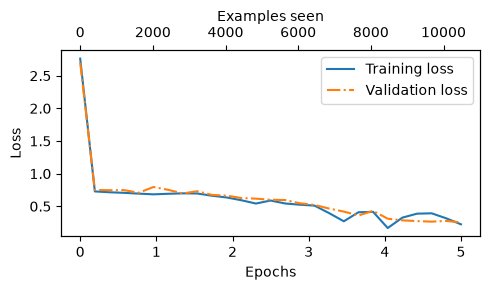
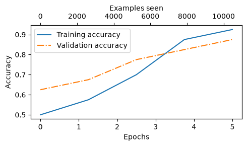

# LLM from Scratch

This repo serves as a structured notepad and roadmap for unpacking, implementing, and mastering the architectural and mathematical concepts of the [GPT-2](https://openai.com/index/better-language-models/) large [transformer](https://arxiv.org/abs/1706.03762)⁠ based language model (LLM) discussed in the [`rasbt/LLMs-from-scratch`](https://github.com/rasbt/LLMs-from-scratch) repository from the excellent ["LLMs from Scratch"](https://www.manning.com/books/build-a-large-language-model-from-scratch) book by [Sebastian Raschka](https://sebastianraschka.com/).

---

## 1. Study Plan

The study plan follows the ["LLMs from Scratch"](https://www.manning.com/books/build-a-large-language-model-from-scratch) book chapter-by-chapter.

The [study plan overview](./studyplan.md) outlines the learning journey and provides the links to the respective notebooks that disect the lessons learned.

## 2. Implementations

This section documents two finetuned implementations of the [GPT-2](https://openai.com/index/better-language-models/) base models.

### 2.1. Finetuning for Sentiment Classification

This [first example](./sentiment.ipynb) builds on the books' the Text Classifcation for SPAM detection from [chapter 6](https://github.com/rasbt/LLMs-from-scratch/blob/main/ch06/01_main-chapter-code/ch06.ipynb) and applies the concepts to finetune a model for [Sentiment Classification](./sentiment.ipynb).

Model: gpt2-small-124M  
Training accuracy: 91.27%  
Validation accuracy: 90.00%  
Test accuracy: 90.17%  

|||
|:-:|:-:|

### 2.2. Finetuning To Follow Instructions

The [second example](./instruction-follow.ipynb) expands on the introduction to instruction finetuning in the book [chapter 7](https://github.com/rasbt/LLMs-from-scratch/blob/main/ch07/01_main-chapter-code/ch07.ipynb) and provides the implementation of a chat interface application with the finetuned model.

